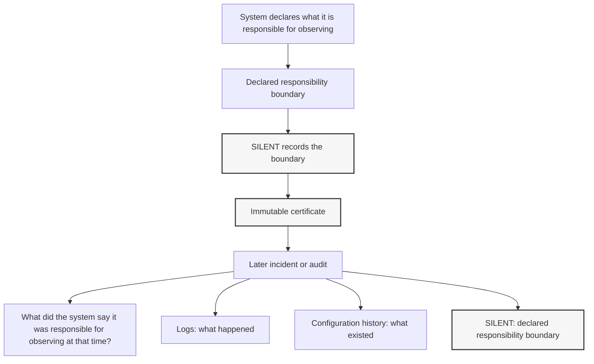

# SILENT

## Definition

> SILENT is a responsibility boundary certificate.
> 
> It records what a system declared it was responsible for observing at a specific point in time.

This definition is canonical and must not be modified.

Any system that alters this definition is no longer SILENT.

---

**Keep the line of responsibility.**

Responsibility boundary certificates for systems.

SILENT is not a general idea.

It is a specific definition of a responsibility boundary certificate.

SILENT defines a minimal specification for recording declared responsibility boundaries.

SILENT captures declared responsibility boundaries as they were stated at that moment.

Logs record what happened.  
Configuration history records what existed.

**SILENT records responsibility boundaries.**

SILENT proves **scope, not reality.**

---

# SILENT in 30 seconds

1. A system declares what it is responsible for observing.
2. SILENT records that declared boundary.
3. If an incident occurs later, the certificate shows what the system said it was responsible for at that time.

SILENT records **declared responsibility boundaries**, not system reality.

---

# What SILENT Does

SILENT generates a single **immutable certificate** describing:

- what a system claimed it was responsible for observing
- what was explicitly outside that responsibility
- when that responsibility boundary was declared

The certificate preserves the **declared observation boundary** that existed at that moment in time.

This record can later be referenced during:

- incident investigations
- security reviews
- audits
- compliance evidence collection

---

# Use Cases

SILENT is useful wherever systems declare responsibility boundaries.

Common scenarios include:

- **Incident investigations**  
  Determine what a platform claimed it was responsible for observing when an incident occurred.

- **Security reviews**  
  Understand what monitoring or detection scope existed at a specific moment.

- **Audit evidence**  
  Provide a verifiable record of declared responsibility boundaries.

- **Compliance documentation**  
  Preserve what was considered in scope during governance or security processes.

SILENT does not determine whether the declaration was correct.

It records that the declaration existed.

---

# Why Existing Records Are Not Enough

Incident investigations often ask a simple question:

What did the system claim it was responsible for observing at that time?

Existing records provide different information:

- Logs record what happened.
- Configuration history records system state.
- Monitoring systems record signals.

However, none of these records preserve the **declared observation responsibility** of the system itself.

SILENT records that declaration as an immutable certificate,
preserving the responsibility boundary that existed at that moment.

SILENT fixes the declared responsibility boundary at the time it was stated,
so the scope of responsibility cannot expand later during incident or audit investigations.

---

# Example

A security platform declares that it observes:

- IAM users  
- IAM roles  
- IAM policies  

It explicitly does **not** observe:

- application data  
- external services  
- secrets outside its scope  

SILENT records this declared responsibility boundary.

If an incident occurs later, the certificate shows **what the platform said it was responsible for observing at that time.**

---

# Intuitive Example

A company signs a contract with a security provider.

The contract states:

> We are responsible for monitoring the cloud infrastructure.

It explicitly excludes:

- application code  
- external services  
- systems outside the agreed scope  

Months later an incident occurs.

The investigation asks:

> What was the provider responsible for at that time?

SILENT preserves that declared boundary when it was stated so the answer cannot change later.

---

## SILENT in One Diagram



# Where SILENT Fits

Modern systems already record many things:

| System Type | Records |
|-------------|--------|
| Logs | what happened |
| Configuration history | what existed |
| Monitoring | what changed |
| Security tools | what might be risky |
| **SILENT** | declared responsibility boundary |

SILENT does not replace security or observability systems.

Instead, it records a different dimension:

**declared responsibility boundaries.**

These certificates can later be referenced during:

- incident investigations
- audit reviews
- compliance evidence collection

---

# Who Should Implement SILENT

SILENT is intended to be implemented by systems that declare observation responsibility boundaries.

Typical implementers may include:

- cloud security platforms
- monitoring and detection systems
- governance and compliance tools
- managed security service platforms

These systems may issue SILENT certificates to record what they declared they were responsible for observing at a specific moment in time.

---

# How SILENT Works

SILENT operates with a deliberately minimal flow.

1. A capture is manually triggered  
2. A scope definition is provided  
3. A certificate is generated and stored  

Each certificate is independent.

There are:

- no background processes
- no continuous monitoring
- no automated decisions
- no external system dependencies

SILENT records the **declared observation boundary at that moment in time.**

---

# Certificate Example

```json
{
  "silent_certificate_version": "1.0",
  "created_at_utc": "2026-01-25T12:31:37Z",
  "scope": {
    "provider": "aws",
    "domain": "iam",
    "resources_included": [
      "iam:users",
      "iam:roles",
      "iam:policies"
    ],
    "resources_excluded": [
      "secrets",
      "payloads",
      "content_bodies"
    ]
  }
}
```

This certificate records what the system declared it was responsible for observing at that moment.

---

# Quick Start

`python tools\gen_keys.py` is required only once per machine.

```powershell
python -m venv .venv
.\.venv\Scripts\Activate.ps1
python -m pip install -U pip
python -m pip install pynacl

python tools\gen_keys.py
python silent.py --sign
python tools\verify_signature.py
```

---

# What SILENT Is Not

SILENT intentionally does **not**:

- detect vulnerabilities
- assess risk
- judge security posture
- evaluate compliance
- recommend actions
- apply fixes
- monitor continuously
- generate alerts
- score environments

SILENT is **not**:

- a monitoring system
- a security scanner
- an observability platform
- a compliance dashboard
- a decision engine

If SILENT begins performing any of these functions,  
it is no longer SILENT.

## Definition Integrity

SILENT must remain strictly limited to recording declared responsibility boundaries.

If SILENT begins to detect, judge, enforce, or interpret,
it is no longer SILENT.

---

# Intended Integration

SILENT is designed to sit upstream of:

- incident response
- audit documentation
- governance workflows
- change reviews

Certificates may be attached to:

- incident tickets
- audit evidence packages
- post-incident reviews
- security investigation reports

SILENT does not enforce policy or perform remediation.

Execution remains outside SILENT.

---

# Optional Signing

SILENT supports optional **Ed25519 detached signatures** for certificates.

Signing provides **tamper evidence only**.

It does not:

- validate correctness
- represent approval
- guarantee security

It simply confirms that the certificate has not been modified after issuance.

---

## Documentation

Additional documentation is available:

- [Specification](./spec/silent-spec.md)
- [Architecture](./ARCHITECTURE.md)
- [Certificate Data Model](./spec/certificate-model.md)
- [Philosophy](./PHILOSOPHY.md)
- [Context](./CONTEXT.md)

---

# Design Principles

### Prepared Silence

SILENT prepares to say nothing until something happens.

---

### Non-Binding

A SILENT certificate records a declaration.  
It does not approve, validate, or guarantee anything.

---

### Scope, Not Reality

SILENT records what a system **claimed it was responsible for observing**,  
not what actually happened.

---

### Minimal Surface

SILENT intentionally minimizes functionality to reduce interpretation and unintended responsibility.

---

### Founder Independent

SILENT must remain understandable without its creator.

---

### A full certificate example is available in:

`examples/certificate_example.json`

---

## Final Note

SILENT does not replace existing security tools.

Logs record what happened.  
Configuration history records what existed.

SILENT records something different:

**the declared responsibility boundary of a system.**

This boundary does not change later.

---

## Background Article

For a conceptual explanation of the idea behind SILENT:

**The Missing Record in Security Systems**  
[https://medium.com/YOUR_ARTICLE_URL
](https://silent-security.medium.com/the-missing-record-in-security-systems-2845cf3a61be)
